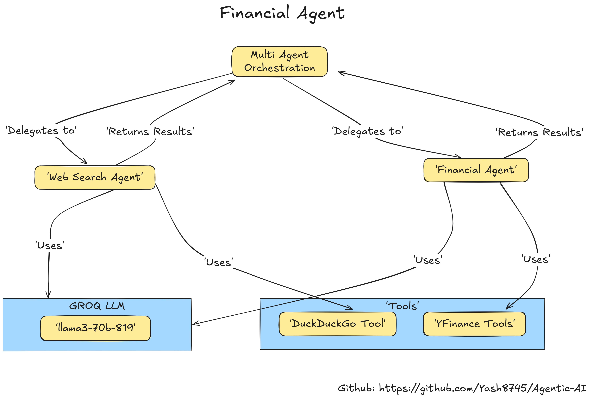
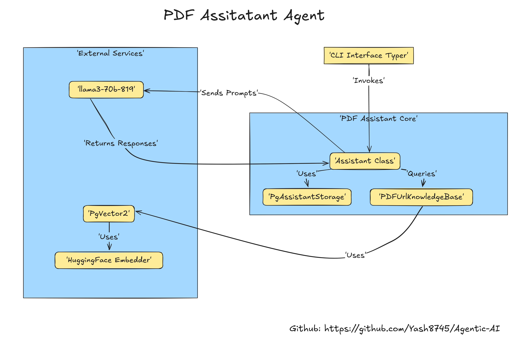

<a id="financial-agent-diagram"></a>
# Agentic AI Project 🚀

<!-- Financial Agent Architectural Diagram Placeholder -->


In Agentic AI Exploration, I designed 2 multi-agent systems that leverages the Groq language model alongside specialized tools to perform tasks such as financial data analysis, web searches, and PDF document assistance. The system integrates multiple APIs and libraries—including DuckDuckGo for web searches, yfinance for financial data, and Hugging Face for PDF embeddings—to provide comprehensive solutions.


## Project Overview

### Agents

- **Multi-Agent Setup**  
  The project features a coordinated multi-agent architecture comprising two main sub-agents:

  - **Web Agent**  
    - Utilizes the DuckDuckGo tool to fetch online information.
    - Configured to always include source citations in its output.

  - **Financial Agent**  
    - Retrieves financial data such as stock prices, analyst recommendations, and company news using the YFinance tool.
    - Displays data in formatted tables.
    - *(Refer to the Financial Agent Diagram above for a visual overview.)*

- **PDF Assistant Agent**  
  Processes PDF documents by:
  - Retrieving content from specified URLs.
  - Embedding the information using a Hugging Face model.
  - Storing the embedded data in a PostgreSQL vector database for interactive querying.

---
## Directory Structure

```
Yash8745-Agentic-Ai/
├── README.md
├── financial_agent.py
├── pdf_assistant.py
├── requirements.txt
└── test.py
```

## Architecture Explanation

### Financial Agent Architecture

The **Financial Agent** is designed to deliver comprehensive financial insights:
- **Tool Calling:** Integrates various tools to pull real-time financial data.
- **Agent Orchestration:** 
    1. Manages the agent's workflow and data retrieval.
    2. The Orchestrator Agent coordinates the Web Agent and Financial Agent.
    3. The Web Agent fetches data from DuckDuckGo and the Financial Agent retrieves financial data from YFinance.


[See the Financial Agent Diagram at the top of this document](#financial-agent-diagram)


### PDF Assistant Architecture

The **PDF Assistant Agent** focuses on document processing:
- **Document Retrieval:** Loads PDF content from predefined URLs.
- **Embedding:** Uses Hugging Face’s model to embed the document content.
- **Storage & Querying:** Saves the embedded data in a PostgreSQL vector database for later retrieval and analysis.


<!-- PDF Agent Architectural Diagram Placeholder -->


## Setup and Installation

### Prerequisites

- **Python:** Version 3.10 or higher.
- **PostgreSQL:** Required for the PDF Assistant. Ensure you have a running PostgreSQL instance with pgvector support.

### Installation Steps

1. **Clone the Repository:**

   ```bash
   git clone https://github.com/yourusername/yash8745-agentic-ai.git
   cd yash8745-agentic-ai
   ```

2. **Install Dependencies:**

   ```bash
   pip install -r requirements.txt
   ```

3. **Configure Environment Variables:**

   Create a `.env` file in the project root and add your configurations. For example:

   ```ini
   GROQ_API_KEY=your_groq_api_key_here
   ```

   Adjust other variables as needed (e.g., database connection strings).

---

## Usage

### Running the Financial Agent

Execute the financial agent script to retrieve and display financial data:

```bash
python financial_agent.py
```

### Running the PDF Assistant

Start the PDF assistant with:

```bash
python pdf_assistant.py
```

- The assistant loads a PDF from a predefined URL.
- It embeds the PDF content using Hugging Face’s custom embedder.
- The data is stored in a PostgreSQL vector database for further querying.
- If a previous session exists, it will continue from there.

### Running the Test Script

Test the web search functionality by running:

```bash
python test.py
```

This script initializes an agent with the DuckDuckGo tool and prints out search results for a query (e.g., "What's happening in France?").

---

## To-Do List ✅

1. **PDF Assistant Issue:**  
   The PDF assistant is running but encounters issues with Hugging Face embedding. Review the error logs and adjust the configuration. *(A video guide is available for additional context if needed.)*

2. **Enhancements:**  
   Refer to the third instructional video for further improvements.

---

## Contributing

Contributions are welcome! If you find issues or have suggestions:
- Open an issue on the repository.
- Submit a pull request with your improvements.

---

## License

Specify your license here (e.g., MIT License).

---

This updated README includes distinct placeholders for both the Financial Agent and PDF Agent diagrams, along with detailed explanations and improved readability. Adjust the diagram paths as needed, and enjoy building your project!